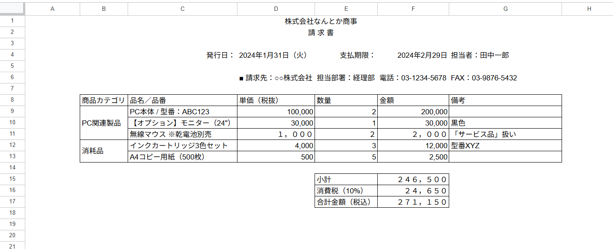
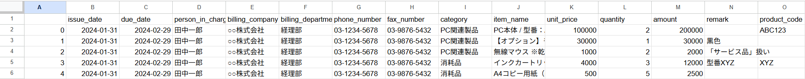

# 請求書データ構造化ツール

## 🔍 課題意識
業務現場では ExcelやPDFなど自由な形式で作られた請求書が多く、情報の集計や分析・会計処理に要するコストが高くなりがちです。 
定型的でないレイアウトの請求書から必要な項目だけを抜き出して構造化する作業には、特に多くの手間がかかります。

## ⚙️ このツールでできること
Excel形式で記載された請求書ファイルを自動的に解析し、以下のような構造化を行います。 
- Excel請求書（自由度の高いレイアウト）を自動的に読み取り
- 品目、金額、税率などを構造化データ（CSV/DF）として抽出

### Before: 構造化前の請求書サンプル

### After: 構造化例

## 💡 構造化データの活用イメージ
WebアプリやBIツールを用いたデータ活用により、現場の業務効率化や経費管理の精度向上を支援できます。
- 月別経費ダッシュボード
- 税区分ごとの支払い比率可視化
- 消耗品と固定資産の判別サポート

## 🔄  このツールが応用できる帳票の例
請求書の構造化処理を前提としていますが、以下のような「レイアウトが固定されていない帳票」や「手作業で情報を抜き出していた資料」にも応用できます：

- 製造現場などで使用される **計測データ記録票**
- 経理・経営企画部門の **月次財務報告書（PDFベース）**
- 医療・介護現場での **業務日誌や対応記録表**
- 顧客提出用の **見積書／納品書**
- その他、Excelベースで項目が埋め込まれた半構造データの書類

将来的には、汎用的な「帳票構造化支援ツール」として、さまざまな業務に役立てられることを目指しています。

## 📂 本コードのデモファイル
- `samples/invoice_sample.xlsx`
- `output/structured_data.csv`

## 🧱 技術構成
- Python 3.x
- Pandas
- openpyxl（Excelファイルの読み書き）
- gspread / oauth2client（Google Sheets連携用）
- Streamlit（可視化UI開発に今後対応予定）

## 🚀 今後の展望（Next steps）
- 請求書以外の帳票テンプレートへの対応強化
- Streamlitによる構造化データの可視化ダッシュボード
- PDFや画像帳票へのOCR対応（Tesseract等）

業務の現場課題に寄り添った実装を継続し、汎用性と実用性の高いツールを目指していきます。